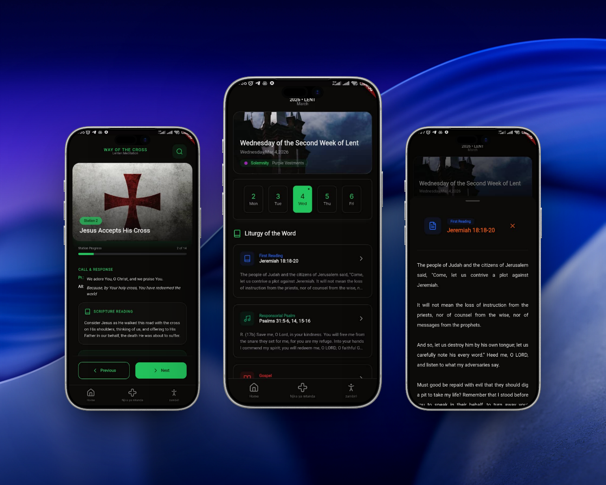
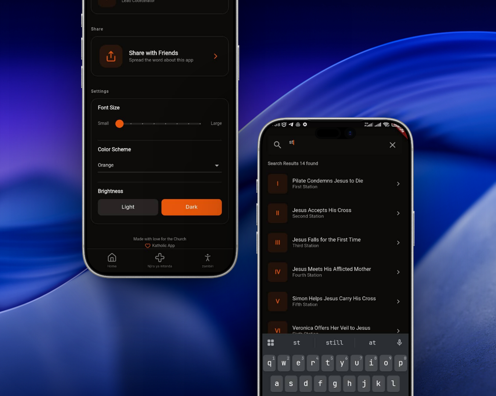

# Katholic app


A Flutter application providing Catholic daily readings and the Way of the Cross, designed to help users engage with their faith through accessible digital tools.

## Features

- **Daily Catholic Readings**: Access liturgical readings for each day, including scriptures and reflections.
- **Way of the Cross**: Interactive stations with prayers, reflections, and meditations.
- **Liturgical Calendar**: View liturgical days and special feast days.
- **Offline Support**: Local database storage for readings and data.
- **Multi-language**: Supports English and Chichewa (Malawi).

## Getting Started

### Prerequisites

- Flutter SDK (^3.10.1)
- Dart SDK
- Android Studio or VS Code with Flutter extensions

### Installation

1. Clone the repository:

   ```bash
   git clone https://github.com/yourusername/njirayamtanda.git
   cd njirayamtanda
   ```

2. Install dependencies:

   ```bash
   flutter pub get
   ```

3. Run the app:
   ```bash
   flutter run
   ```

### Building for Different Platforms

- **Android**: `flutter build apk`
- **iOS**: `flutter build ios` (requires macOS)
- **Web**: `flutter build web`
- **Linux**: `flutter build linux`
- **Windows**: `flutter build windows`

## Usage

- **Home Screen**: View daily readings and liturgical information.
- **Way of the Cross**: Navigate through the 14 stations with prayers and reflections.
- **More**: Access additional features and settings.

The app loads initial data from JSON files and stores it in a local SQLite database for offline access.

## Contributing

We are _not_ accepting contributions!:

- The codebase is currently messy and not up to standard but you can open an issue.
- When the code is up in quality we will accept contributions.
- currently you can leave a star for the repo

### Development Setup

- Run tests: `flutter test`
- Lint code: `flutter analyze`
- Format code: `dart format .`

## License

This project is licensed under the MIT License - see the [LICENSE](LICENSE) file for details.

## Support

If you find this app helpful, consider supporting its development through donations.

Made with love for the Church.

